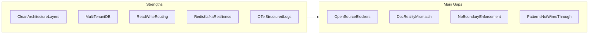
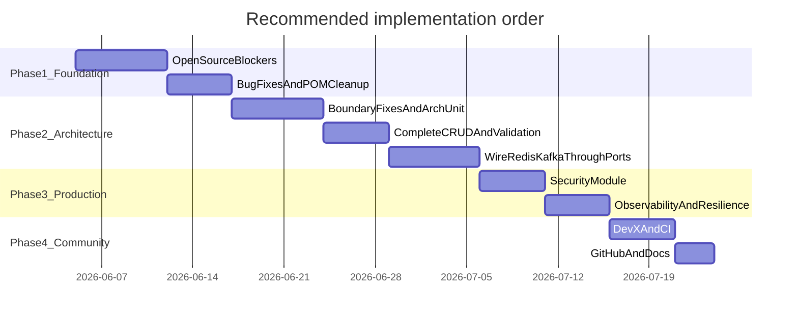

# Java Service Template — Review and Enhancement Recommendations

## Current State Assessment

This is already a **strong, opinionated starter** with real production patterns many templates skip: multi-tenant MySQL routing, read/write replica selection, Flyway migrations, Redis, Kafka with Resilience4j, OpenTelemetry, Cucumber integration tests, and Docker local stack.

What holds it back from being “best in class” is less missing features and more **(a) open-source readiness**, **(b) README vs reality gaps**, and **(c) incomplete wiring** of patterns that are configured but not exercised end-to-end.



---

## Tier 1 — Fix Before More Features (Open-Source Readiness)

These are the highest-impact items because they affect **every clone of the repo**.

### 1. Remove or replace internal-only dependencies

| Issue | Location | Recommendation |
|-------|----------|----------------|
| `in.olx:assertx` for integration tests | [`pom.xml`](pom.xml), [`src/test/java/.../it/ITMain.java`](src/test/java/com/olx/boilerplate/it/ITMain.java) | Replace with **Testcontainers** (already declared) + `@SpringBootTest` or Cucumber + RestAssured. Provide a `docker-compose-it.yml` or programmatic containers. |
| Maven wrapper points to OLX JFrog | [`.mvn/wrapper/maven-wrapper.properties`](.mvn/wrapper/maven-wrapper.properties) | Switch to standard Maven Central distribution URL. |
| `groupId` is `com.example` but packages are `com.olx.boilerplate` | [`pom.xml`](pom.xml) | Align to one namespace (e.g. `com.example.boilerplate`) and document a **one-command rename script** or GitHub template variable. |

### 2. Close README vs code mismatches

The README claims several things that are **not wired**:

- **Rate limiting** (Resilience4j) — dependency only, no `@RateLimiter` usage
- **SpotBugs / OWASP** — config files exist ([`spotbugs-exclude-filter.xml`](spotbugs-exclude-filter.xml), [`owasp-dependency-check-suppressions.xml`](owasp-dependency-check-suppressions.xml)) but plugins are not in [`pom.xml`](pom.xml) build section or [`.github/workflows/package-verify.yml`](.github/workflows/package-verify.yml)
- **Missing diagram** — README references `CleanArchitecture.jpg` but file is absent
- **Package layout** — README shows top-level `repository/`; actual path is [`domain/repository/`](src/main/java/com/olx/boilerplate/domain/repository/)

**Recommendation:** Either implement what the README promises or trim the README to match reality. For a template, **implement + CI-enforce** is the better choice.

### 3. Fix known wiring bugs

These undermine trust in the template:

- [`V1.0__Initial_Schema.sql`](src/main/resources/db/migration/common/V1.0__Initial_Schema.sql) — `tbl_user` defined twice (second block appears to be `tbl_order`)
- [`KafkaProducerConfig`](src/main/java/com/olx/boilerplate/infrastructure/appConfig/kafka/KafkaProducerConfig.java) — missing `@Configuration`
- YAML prefix `KafkaClientConfig:` vs Java `@ConfigurationProperties(prefix = "kafka")` in [`KafkaCommonConfig`](src/main/java/com/olx/boilerplate/infrastructure/appConfig/kafka/KafkaCommonConfig.java)
- [`TenantFilter`](src/main/java/com/olx/boilerplate/infrastructure/components/TenantFilter.java) uses `javax.servlet` on Spring Boot 3 (Jakarta)
- Read/write routing via [`TransactionalContextInterceptor`](src/main/java/com/olx/boilerplate/infrastructure/data/config/TransactionalContextInterceptor.java) needs `spring-boot-starter-aop` in POM
- Duplicate SpringDoc artifacts (v1 + v2) in POM — keep only `springdoc-openapi-starter-webmvc-ui`
- Actuator endpoints `custom`, `cache-evict` configured in YAML but no `@Endpoint` implementations

---

## Tier 2 — Strengthen Clean Architecture (Differentiator)

Most Java templates are “Spring Boot with folders.” Yours can stand out by **demonstrating and enforcing** clean boundaries.

### 4. Fix dependency-rule violations

Current leaks:

- [`Order.java`](src/main/java/com/olx/boilerplate/domain/Order.java) imports controller DTO `CreateOrderRequest`
- Use cases ([`CreateUser`](src/main/java/com/olx/boilerplate/usercase/users/CreateUser.java), [`CreateOrder`](src/main/java/com/olx/boilerplate/usercase/order/CreateOrder.java)) accept controller DTOs directly
- [`UserRepository`](src/main/java/com/olx/boilerplate/domain/repository/UserRepository.java) has Spring `@Repository`

**Recommended pattern:**

```
controller/dto  →  application/command (CreateUserCommand)  →  domain  →  repository port
domain  →  application/result or response mapper in controller  →  controller/dto
```

Add **ArchUnit** tests to enforce:

- `domain` must not depend on `controller`, `infrastructure`, or Spring
- `usercase` must not depend on `infrastructure` or JPA
- `infrastructure` implements `domain.repository` only

This alone would put the template ahead of 90% of “clean architecture” repos.

### 5. Complete the example domain flows

The template has orphan DTOs (`UpdateUserRequest`, `UpdateOrderRequest`) and inconsistent APIs:

- Users: no update endpoint; `GetUser` throws; Orders: `Optional` + controller-level 404
- [`OrderController`](src/main/java/com/olx/boilerplate/controller/OrderController.java) lacks `@ReadOnlyTransaction` / `@ReadWriteTransaction`; [`UserController`](src/main/java/com/olx/boilerplate/controller/UserController.java) has them

**Add as reference implementations:**

- Full CRUD for User and Order
- List + pagination (`Pageable`, `GET /users?page=&size=`)
- Bean Validation on request DTOs + `@ControllerAdvice` handler for `MethodArgumentNotValidException`
- Consistent 404 strategy (prefer `Optional` + use-case-level `NotFoundException`)

### 6. Wire infrastructure through ports (not demo endpoints only)

Redis and Kafka are only exposed via [`ClientController`](src/main/java/com/olx/boilerplate/controller/ClientController.java). Demonstrate real usage:

- **Cache:** `@Cacheable` on `GetUser` / `GetOrder`, `@CacheEvict` on mutations, plus a working custom Actuator `cache-evict` endpoint
- **Events:** domain event `UserCreated` → application publishes via `EventPublisher` port → Kafka adapter; optional **Transactional Outbox** table + Flyway migration (high-value differentiator)
- **External HTTP:** one complete example calling a WireMock-backed client through a port (Resilience4j circuit breaker in action)

Rename `usercase` → `usecase` (or `application`) and add a short [`ARCHITECTURE.md`](ARCHITECTURE.md) with dependency rules and request lifecycle diagram.

---

## Tier 3 — Production-Grade Patterns (What “Best Template” Means)

### 7. Security and API hardening

Dependencies exist (`spring-security-core`, `java-jwt`) but no implementation. Add a **minimal, swappable auth module**:

- JWT resource-server filter (or API-key for simplicity) with `@PreAuthorize` example
- Spring Security filter chain that runs **after** tenant resolution
- CORS, security headers, and request size limits
- [`SECURITY.md`](SECURITY.md) for responsible disclosure

Even a “disabled by default, enable via profile” security setup teaches the right pattern without forcing auth on every user.

### 8. Observability completeness

You have OTel agent + Logstash encoder — extend to a full story:

- Micrometer **Prometheus** registry + example Grafana dashboard JSON
- MDC filter setting `tid` / `cid` from headers (fields already in [`logback.xml`](src/main/resources/logback.xml))
- Structured log correlation with trace IDs
- Custom business metrics example (`@Timed`, counter for orders created)
- Health groups: `liveness` / `readiness` with DB + Redis + Kafka checks

### 9. Resilience patterns (make README claims true)

Add working examples in a dedicated `infrastructure/clients/` sample:

- Circuit breaker + retry + **rate limiter** + bulkhead (Resilience4j)
- `@Retryable` (Spring Retry) for idempotent operations
- Timeout configuration aligned with [`HttpConfig`](src/main/java/com/olx/boilerplate/infrastructure/appConfig/HttpConfig.java)

### 10. Database and migration maturity

- Fix migration SQL; add seed data for local profile
- Document multi-tenant migration workflow ([`migrate.sh`](migrate.sh)) with a diagram
- Optional: PostgreSQL profile alongside MySQL (driver already on classpath)
- Testcontainers-based Flyway validation in CI

---

## Tier 4 — Developer Experience and Community Polish

### 11. Local dev ergonomics

Add:

- [`Makefile`](Makefile) with targets: `build`, `test`, `it`, `run`, `docker-up`, `migrate`, `format`
- [`.env.example`](.env.example) documenting `DB_HOST`, `REDIS_HOST`, `KAFKA_HOST`, etc.
- Kafka + Zookeeper (or KRaft) in [`docker-compose-local.yml`](docker-compose-local.yml) — README already implies Kafka works locally
- `mvnw.cmd` for Windows contributors
- [`.editorconfig`](.editorconfig) aligned with [`formatter.xml`](formatter.xml)
- Pre-commit or GitHub Action for formatter validation (wire existing formatter plugin)

### 12. CI/CD upgrades

Enhance [`.github/workflows/package-verify.yml`](.github/workflows/package-verify.yml):

- Maven dependency cache
- SpotBugs + OWASP + formatter in verify phase
- JaCoCo report upload (Codecov or artifact)
- Optional: build and scan Docker image (Trivy)
- Fix [`.github/dependabot.yml`](.github/dependabot.yml) (currently invalid stub)
- Add release workflow (tags → GitHub Release + Docker image)

### 13. GitHub open-source essentials

Missing but expected for a flagship template:

- [`CODE_OF_CONDUCT.md`](CODE_OF_CONDUCT.md)
- [`SECURITY.md`](SECURITY.md)
- Issue templates (bug, feature, question)
- PR template with test plan checklist
- `CODEOWNERS` (optional)
- “Use this template” button + [`template/README`](https://docs.github.com/en/repositories/creating-and-managing-repositories/creating-a-template-repository) guidance

### 14. Documentation depth

Beyond README:

- **ARCHITECTURE.md** — layers, ports/adapters, tenant routing, read/write split
- **ADRs** — e.g. “Why Flyway over Liquibase”, “Why single module vs multi-module”
- **RUNBOOK.md** — deploy, migrate, rotate secrets, troubleshoot
- **CONTRIBUTING.md** update — document IT strategy after assertx removal
- Annotate controllers with SpringDoc `@Operation` / `@Tag` and commit generated OpenAPI spec to `docs/openapi.yaml`

---

## Tier 5 — Advanced Differentiators (Optional, High Impact)

Pick 2–3 to avoid scope creep; these would genuinely distinguish the repo:

| Feature | Why it matters |
|---------|----------------|
| **Multi-module Maven** (`domain`, `application`, `adapters`, `bootstrap`) | Enforces compile-time boundaries; gold standard for clean architecture templates |
| **Transactional Outbox + Kafka consumer** | Shows event-driven pattern done correctly |
| **Feature flags** (e.g. Unleash or simple DB-backed) | Common in microservices, rarely in templates |
| **Idempotency key middleware** | Essential for POST APIs in distributed systems |
| **OpenFeature / observability of feature toggles** | Modern standard |
| **GraalVM native image profile** | Spring Boot 3 + Java 21 native compilation example |
| **Contract testing** (Spring Cloud Contract or Pact) | API consumer/provider example |
| **Renovate** alongside Dependabot | Better Java/Maven ecosystem support |
| **GitHub Copilot / Cursor rules** (`.cursor/rules` or `AGENTS.md`) | Helps AI-assisted development match your conventions |
| **Sample k8s manifests** (Deployment, Service, ConfigMap, HPA) | Bridge from template to production |

---

## Suggested Roadmap



**Phase 1 (must-do):** assertx → Testcontainers, wrapper URL, POM cleanup, migration SQL fix, README accuracy, CI quality gates.

**Phase 2 (architecture credibility):** ArchUnit, application commands, complete CRUD, validation, consistent error handling, rename `usercase`.

**Phase 3 (production story):** auth module, Prometheus, cache/events through ports, rate limiting demo.

**Phase 4 (community):** GitHub templates, ARCHITECTURE.md, Makefile, `.env.example`, release automation.

---

## What Makes a Template “The Best”

The bar for top Java templates (e.g. Spring initializr output, Baeldung/specialized hexagonal starters) is:

1. **Clone and run in &lt;5 minutes** — no private repos, no broken Docker stack
2. **Teaches one clear architectural story** — enforced by tests, not just folder names
3. **Every advertised feature has a working example** — not just a dependency
4. **Production paths are visible** — security, observability, migrations, CI
5. **Easy to adapt** — rename script, modular boundaries, good docs

Your template already has (5)’s hard parts (multi-tenancy, read replicas). Doubling down on **enforcement**, **open-source self-containment**, and **end-to-end wired examples** is the highest-leverage path to “best Java template repo.”
