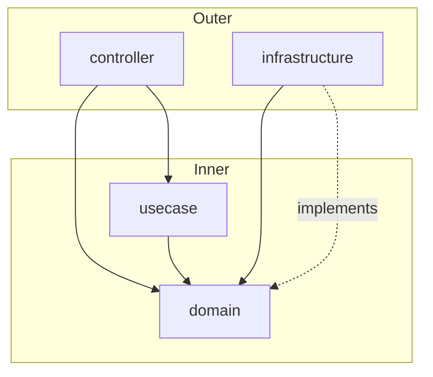
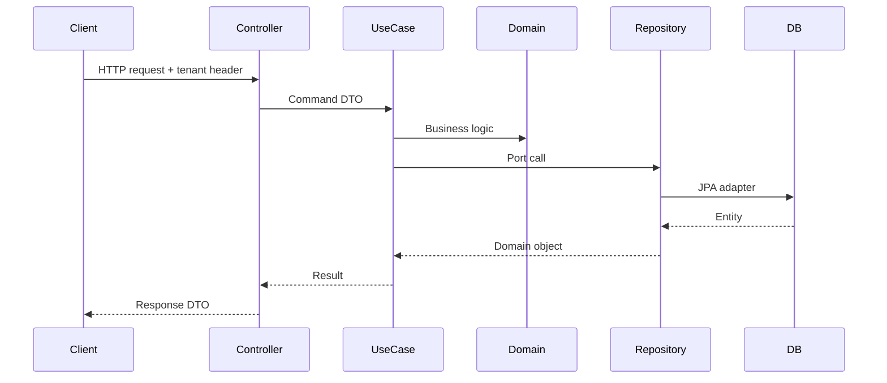

# Clean Architecture

This service follows **Clean Architecture** with explicit layer boundaries enforced by [ArchUnit](../src/test/java/com/olx/boilerplate/ut/ArchitectureTest.java).

## Layers

| Layer | Package | Responsibility |
|-------|---------|----------------|
| Controllers | `controller` | HTTP, validation, DTO mapping |
| Use cases | `usecase` | Application workflows, commands |
| Domain | `domain` | Entities, ports, domain exceptions |
| Infrastructure | `infrastructure` | Adapters: JPA, Redis, Kafka, config |

**Dependency rule:** outer layers depend on inner layers. The domain has no framework dependencies.

## Dependency diagram



## Request lifecycle



## Ports and adapters

| Port (domain) | Adapter (infrastructure) |
|---------------|----------------------------|
| `UserRepository` | `UserRepositoryImpl` + JPA |
| `OrderRepository` | `OrderRepositoryImpl` + JPA |
| `EventPublisher` | `OutboxEventPublisher` → `OutboxRelayScheduler` → Kafka |

Use cases depend on port interfaces; Spring wires concrete adapters at runtime.

## Multi-tenancy and read/write routing

1. `TenantFilter` resolves tenant from `X-Default-Tenant` or `X-Default-Host`.
2. `@ReadOnlyTransaction` / `@ReadWriteTransaction` on controllers set DB context.
3. `CustomRoutingDataSource` selects tenant + master/replica pool.

## Events and caching

- **Domain port:** `EventPublisher` enqueues `UserCreatedEvent` via the transactional outbox
- **Write adapter:** `OutboxEventPublisher` persists JSON to `outbox_event` in the same DB transaction
- **Relay worker:** `OutboxRelayScheduler` + `OutboxRelayService` publish pending rows to Kafka
- **Cache:** `@Cacheable` / `@CacheEvict` on user and order read/write use cases

See **[outbox-pattern.md](outbox-pattern.md)** for workflow, package layout, and adding new event types.

## Security (optional)

Set `spring.security.enabled=true` and provide `security.jwt.secret` to enable JWT bearer authentication.

## Observability

- Structured JSON logs with `tid` / `cid` correlation IDs (`CorrelationIdFilter`)
- Prometheus metrics at `/metrics` (management port 8081)
- OpenTelemetry agent support in `Dockerfile`

## Integration tests

Cucumber scenarios run against a Spring Boot test context with **Testcontainers** (MySQL, Redis, Kafka). No internal test frameworks required.

```bash
make it
```

## Adding a new feature

1. Add domain entity and repository port under `domain/`
2. Add command + use case under `usecase/`
3. Add request/response DTOs and controller
4. Implement repository adapter in `infrastructure/data/repository/`
5. Add unit tests and a Cucumber scenario

See also [low-level design](low-level-design.md) for component-level detail.
