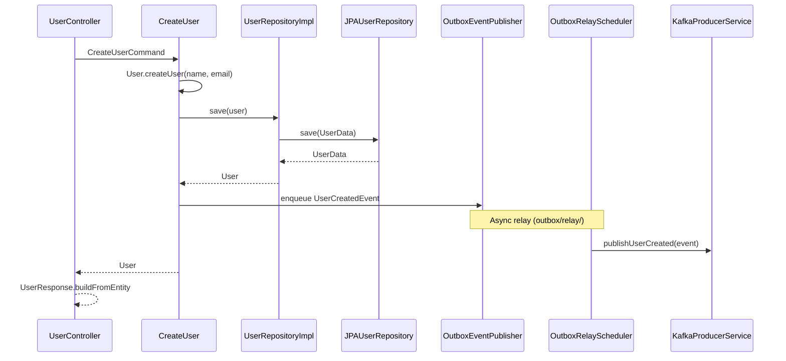
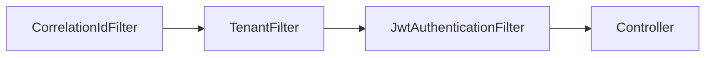

# Low-Level Design

This document describes how major components interact inside the template service.

## Package layout

```
src/main/java/com/olx/boilerplate/
├── controller/              REST endpoints, request/response DTOs
├── usecase/                 Application services and command objects
│   ├── users/
│   └── order/
├── domain/                  Entities, repository ports, domain events
│   ├── repository/
│   ├── port/
│   └── exception/
└── infrastructure/          Framework adapters and configuration
    ├── appConfig/           Spring beans, security, Kafka, Redis, DB
    ├── components/          Filters, event publisher, HTTP client
    ├── data/                JPA entities and repository implementations
    └── clients/             External HTTP integrations
```

## User creation flow



Key classes:

| Class | Role |
|-------|------|
| `CreateUserRequest` | Validates HTTP input, maps to `CreateUserCommand` |
| `CreateUser` | Orchestrates save + event publish; evicts `users` cache |
| `User` | Domain factory and invariants |
| `UserRepositoryImpl` | Maps between `User` and `UserData` JPA entity |
| `OutboxEventPublisher` | Implements `EventPublisher`; writes to `outbox_event` |
| `OutboxRelayScheduler` | Background worker in `outbox/relay/` |

## Order management

Orders follow the same controller → use case → repository pattern:

| Use case | Cache | Transaction |
|----------|-------|-------------|
| `CreateOrder` | Evicts `orders` | Write |
| `GetOrder` | `@Cacheable` | Read |
| `ListOrders` | `@Cacheable` | Read |
| `UpdateOrder` | Evicts `orders` | Write |
| `DeleteOrder` | Evicts `orders` | Write |

Controllers annotate endpoints with `@ReadOnlyTransaction` or `@ReadWriteTransaction` to route to replica or master pools.

## Data access

### Routing data source

`ServiceDependencyModule` builds a `CustomRoutingDataSource` with one Hikari pool per tenant for master and replica:

- Key `default` → master pool for tenant `default`
- Key `default-read` → replica pool for tenant `default`

`DataSourceConfig` resolves JDBC URLs and credentials per tenant, with optional overrides in `datasource.overrides`.

### Repository adapter pattern

```
UserRepository (port)
    └── UserRepositoryImpl
            └── JPAUserRepository (Spring Data)
                    └── UserData (JPA entity)
```

Domain objects never reference JPA annotations. Mapping happens in `UserData.from()` / `fromThis()`.

## HTTP pipeline

Incoming requests pass through filters before reaching controllers:



| Filter | Purpose |
|--------|---------|
| `CorrelationIdFilter` | Sets MDC `tid` / `cid` for log correlation |
| `TenantFilter` | Resolves tenant from headers into request context |
| `JwtAuthenticationFilter` | Validates Bearer token when security is enabled |

## External HTTP client

`ExternalHttpClient` wraps OkHttp with Resilience4j:

- Circuit breaker (configurable per client in `application.yaml`)
- Retry with exponential backoff
- Rate limiter (`ResilienceConfig`)

Beans are assembled in `ServiceDependencyModule` from `ExternalClientsConfig`.

## Messaging

| Component | Package | Responsibility |
|-----------|---------|----------------|
| `EventPublisher` | `domain/port` | Domain port for publishing events |
| `OutboxEventPublisher` | `infrastructure/outbox` | Enqueues events to `outbox_event` |
| `OutboxRelayScheduler` | `infrastructure/outbox/relay` | Polls and relays unpublished events |
| `OutboxRelayService` | `infrastructure/outbox/relay` | Publishes one event to Kafka per transaction |
| `KafkaProducerService` | `infrastructure/components` | Kafka send with retry + circuit breaker |
| `KafkaProducerConfig` | `infrastructure/appConfig/kafka` | Producer factory and topic configuration |

`UserCreatedEvent` is written to the outbox after a successful user save and relayed asynchronously. See [outbox-pattern.md](outbox-pattern.md).

## Database migrations

Flyway scripts are split by scope:

| Location | Purpose |
|----------|---------|
| `db/migration/common/` | Shared schema (users, orders, outbox) |
| `db/migration/<tenant>/` | Tenant-specific seed data |

`migrate.sh` runs Flyway per schema listed in `SCHEMAS_TO_MIGRATE` (from `.env`).

## Caching

Redis backs Spring Cache via `RedisCacheManager` in `ServiceDependencyModule`.

- Local profile uses standalone Redis (`redis.mode: STANDALONE` in `application-local.yaml`)
- Default profile expects cluster mode; override in profile-specific YAML

Evict all entries on writes; cache individual reads by key (e.g. user ID).

## API surface

| Resource | Base path | Notes |
|----------|-----------|-------|
| Users | `/user` | CRUD + paginated list |
| Orders | `/orders` | CRUD + paginated list |
| Health | `/health` | App ping |
| Actuator | port 8081 | `/health/liveness`, `/metrics`, `/cache-evict` |

OpenAPI annotations on controllers; Swagger UI at `/swagger-ui/index.html`.

## Testing strategy

| Layer | Tool | Location |
|-------|------|----------|
| Architecture rules | ArchUnit | `ut/ArchitectureTest.java` |
| Unit | JUnit 5 + Mockito | `ut/` |
| Integration | Cucumber + Testcontainers | `it/` + `features_and_scenarios/` |

Integration tests boot a real MySQL, Redis, and Kafka via Testcontainers — no manual Docker setup required for `make it`.
