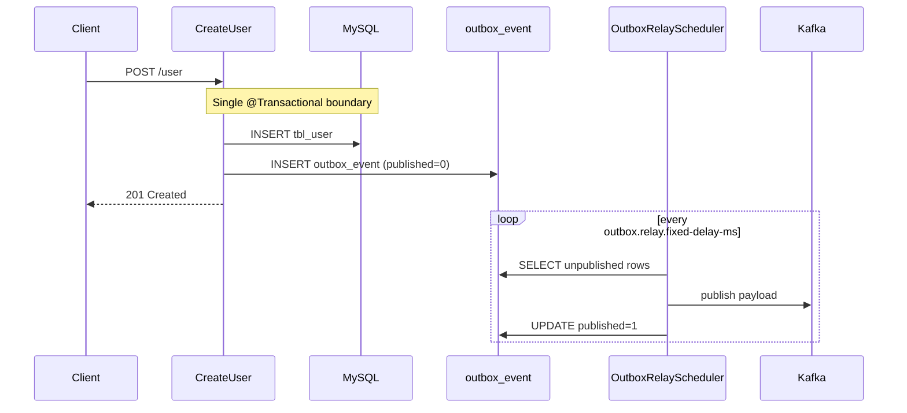

# Transactional Outbox Pattern

This template implements the **transactional outbox pattern** so domain events are never lost when Kafka is temporarily unavailable.

## Problem it solves

Publishing directly to Kafka inside a business transaction creates a **dual-write** problem:

1. User row is saved in MySQL
2. Kafka publish fails (broker down, network blip, timeout)

The database commit succeeds but the event is lost. Consumers never see the change.

The outbox pattern fixes this by writing the event to an **outbox table in the same database transaction** as the business data. A separate **relay worker** publishes pending rows to Kafka asynchronously.

## Benefits

| Benefit | Description |
|---------|-------------|
| **Atomicity** | User + outbox row commit or roll back together |
| **At-least-once delivery** | Failed Kafka publishes are retried on the next relay cycle |
| **Decoupled transport** | Use cases depend on `EventPublisher`, not Kafka APIs |
| **Operational visibility** | Inspect `outbox_event` for backlog or stuck messages |
| **Template-ready** | Copy the outbox package and relay config for new event types |

## How it works in this template



### 1. Write path (request thread)

| Component | Role |
|-----------|------|
| `CreateUser` | Saves user, calls `EventPublisher` inside `@Transactional` |
| `EventPublisher` | Domain port — use cases stay transport-agnostic |
| `OutboxEventPublisher` | Adapter — inserts JSON payload into `outbox_event` (`infrastructure/outbox/`) |

Example flow for user creation:

```java
// usecase/users/CreateUser.java
@Transactional
public User execute(CreateUserCommand command) {
    User saved = userRepository.save(user);
    eventPublisher.publishUserCreated(new UserCreatedEvent(...));
    return saved;
}
```

The use case does **not** call Kafka directly.

### 2. Relay path (background worker)

| Component | Role |
|-----------|------|
| `OutboxRelayScheduler` | Polls on a fixed delay (`@Scheduled`) — `infrastructure/outbox/relay/` |
| `OutboxRelayService` | Publishes one event per transaction (`REQUIRES_NEW`) — `infrastructure/outbox/relay/` |
| `OutboxTopicResolver` | Maps `event_type` → Kafka topic — `infrastructure/outbox/relay/` |
| `KafkaProducerService` | Sends to Kafka with retry + circuit breaker |

Each event is relayed in its own transaction so one failure does not roll back others.

## Database schema

Migration: `src/main/resources/db/migration/common/V1.2__Outbox_Event.sql`

```sql
CREATE TABLE outbox_event (
    id          BIGINT UNSIGNED AUTO_INCREMENT PRIMARY KEY,
    event_type  VARCHAR(128) NOT NULL,
    payload     TEXT         NOT NULL,
    created_at  TIMESTAMP    NOT NULL DEFAULT CURRENT_TIMESTAMP,
    published   TINYINT(1)   NOT NULL DEFAULT 0
);
```

Index for relay polling: `V1.3__Outbox_Event_Index.sql`

## Configuration

```yaml
outbox:
  relay:
    enabled: true              # set false in tests or when Kafka relay is not needed
    fixed-delay-ms: 5000       # poll interval
    batch-size: 50             # max events per cycle
    topics:
      UserCreatedEvent: user-created   # event_type → Kafka topic
```

If no mapping exists, the relay falls back to the first topic in `kafka.topics`.

Integration tests disable the relay (`application-integration-test.yaml`) to keep Cucumber scenarios deterministic.

## Adding a new event type

Follow this checklist when introducing another domain event:

1. **Domain** — Add event class under `domain/event/` and constant in `OutboxEventTypes`
2. **Port** — Add method to `EventPublisher` (e.g. `publishOrderCreated(...)`)
3. **Adapter** — Implement in `OutboxEventPublisher` (enqueue row with JSON payload)
4. **Use case** — Call the port inside an existing `@Transactional` write method
5. **Config** — Map event type to Kafka topic under `outbox.relay.topics`
6. **Tests** — Unit test the publisher + relay; add integration coverage if needed

Example constant:

```java
public final class OutboxEventTypes {
    public static final String USER_CREATED = "UserCreatedEvent";
    public static final String ORDER_CREATED = "OrderCreatedEvent";
}
```

Example relay topic mapping:

```yaml
outbox:
  relay:
    topics:
      UserCreatedEvent: user-created
      OrderCreatedEvent: order-created
```

## Package layout

Packages follow the same **technical role** split as User/Order persistence:

```
src/main/java/com/olx/boilerplate/
├── domain/
│   ├── event/OutboxEventTypes.java
│   └── port/EventPublisher.java
└── infrastructure/
    ├── appConfig/OutboxRelayProperties.java
    ├── data/
    │   ├── entities/OutboxEventData.java
    │   └── repository/OutboxEventJpaRepository.java
    └── outbox/
        ├── OutboxEventPublisher.java       # EventPublisher adapter (write path)
        └── relay/
            ├── OutboxRelayScheduler.java   # Scheduled poller
            ├── OutboxRelayService.java     # Per-event relay logic
            └── OutboxTopicResolver.java    # event_type → Kafka topic
```

## Operations

### Inspect pending events

```sql
SELECT id, event_type, created_at, published
FROM outbox_event
WHERE published = 0
ORDER BY created_at;
```

### Replay / troubleshoot

- **Kafka down** — rows stay `published = 0`; relay retries automatically when Kafka recovers
- **Poison message** — check application logs for `Failed to relay outbox event`; fix payload or skip row manually
- **Disable relay** — set `outbox.relay.enabled=false` (events accumulate in DB until re-enabled)

See also [runbook.md](runbook.md) for deploy and health checks.

## Related docs

- [Clean architecture](clean-architecture.md) — ports and adapters
- [Low-level design](low-level-design.md) — messaging overview
- [Features](features.md) — template capabilities
